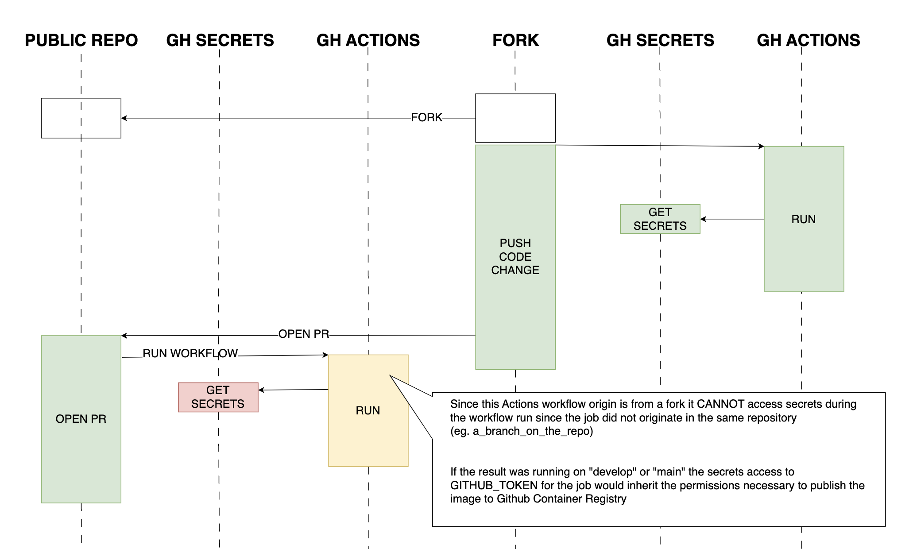
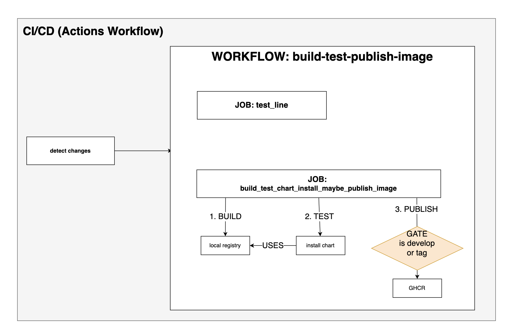

CICD Test Automation
========================

This repository contains several GitHub Action workflows that enable functional verification of the Cloudzero Charts.

## Prerequisites

GitHub Actions is a powerful tool that allows developers to automate, customize, and execute their software development workflows directly in the GitHub repository. This guide will help you understand how to write and test GitHub Action workflows and use [docker](https://docs.docker.com/desktop/install/mac-install/) and the [act utility](https://github.com/nektos/act) for local development and testing.

## List All Workflows:

To list all available workflows, run the following command:

```bash
act -l
```

Here is an example output:

```bash
Stage  Job ID                                        Job name                                      Workflow name             Workflow file                 Events           
0      build-and-publish-chart                       build-and-publish-chart                       build-and-publish-chart   build-and-publish-chart.yml   push             
0      has_changes                                   has_changes                                   build_test_publish_image  build-test-publish-image.yml  push,pull_request
0      scanner                                       scanner                                       detection_rules           change-detector.yml           workflow_call    
1      test_chart_lint                               test_chart_lint                               build_test_publish_image  build-test-publish-image.yml  pull_request,push
1      build_test_chart_install_maybe_publish_image  build_test_chart_install_maybe_publish_image  build_test_publish_image  build-test-publish-image.yml  push,pull_request
```

## Verify a Specific Workflow (DRY-RUN mode):

To verify a specific workflow in DRY-RUN mode, use the following command:

```bash
act --dry-run -j build_test_chart_install_maybe_publish_image -s CZ_API_TOKEN=$CZ_API_TOKEN -a $GITHUB_USER --secret GITHUB_TOKEN=$GITHUB_TOKEN
```

Please note that adding the `-n` or `--dry-run` flag only validates that the jobs are syntactically correct.

## Run a Specific Workflow:

To run a specific workflow, use the following command:

```bash
act --dry-run -j build_test_chart_install_maybe_publish_image -s CZ_API_TOKEN=$CZ_API_TOKEN -a $GITHUB_USER --secret GITHUB_TOKEN=$GITHUB_TOKEN
```

---

Special Topics
=================

### Repository Secrets & Permissions



GitHub Actions `Secrets` are a protected resource. In the open-source development model, it is common to fork a repository, make changes, and then submit a `Pull Request` back to the original repository.

However, GitHub Actions does not allow `write` permissions for the automatic `GITHUB_TOKEN` scope. To ensure the workflow can be run in different scenarios without compromising security, the following design considerations have been made:

1. Local Fork: The pipeline can be run locally on a fork, allowing all steps to be tested. In this case, a local `github_token` is used.

2. Fork's CI/CD: The pipeline can be run in a fork's CI/CD environment, where repository write permissions are available. This allows all steps to be executed.

3. Upstream Repository with PR: When a pull request is submitted from a fork to the upstream repository, the pipeline can be run in the upstream repository. At this point, a read-only token is used. The workflow will build and test using a local registry, but image publishing steps are not possible.

4. Merge to Develop/Main: When the code merges to the `develop` or `main` branch, the pipeline will run. It will build and test the chart, and if successful, it will publish the image to GHCR (GitHub Container Registry).

This flow enables development using repository forks while ensuring publishing safety based on the repository context.

---

### Building Images & Chart Testing




The image builder workflow outlined above provides the following functionality:

1. Each push triggers a code scan to determine if any changes have been made that would impact the validator image or the helm chart.

2. If a change is detected, two parallel workflows are started:
    1. **Chart Linting**: The helm chart linter workflow ensures that the chart conforms to development best practices.
    2. **Image Build, Test, Publish**: The image-build-test-publish workflow performs the following steps:
       - Builds the image and stores it in a local registry deployed into a KinD Kubernetes cluster.
       - Runs the chart installation to validate that the chart and the image are working as expected.
       - **_Conditionally_** publishes the image by copying it to GHCR if either of the following conditions are met:
         - The current branch is either `develop` or `main`.
         - The branch is a `release tag`.

