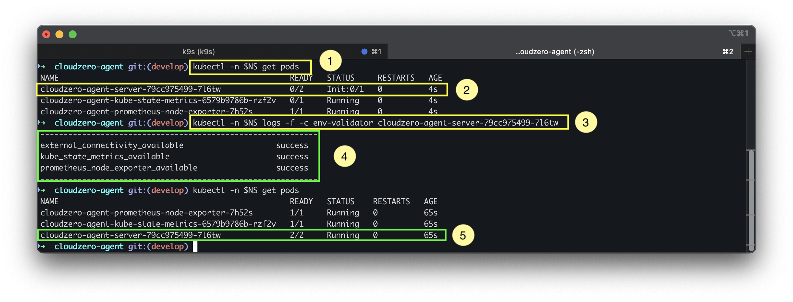
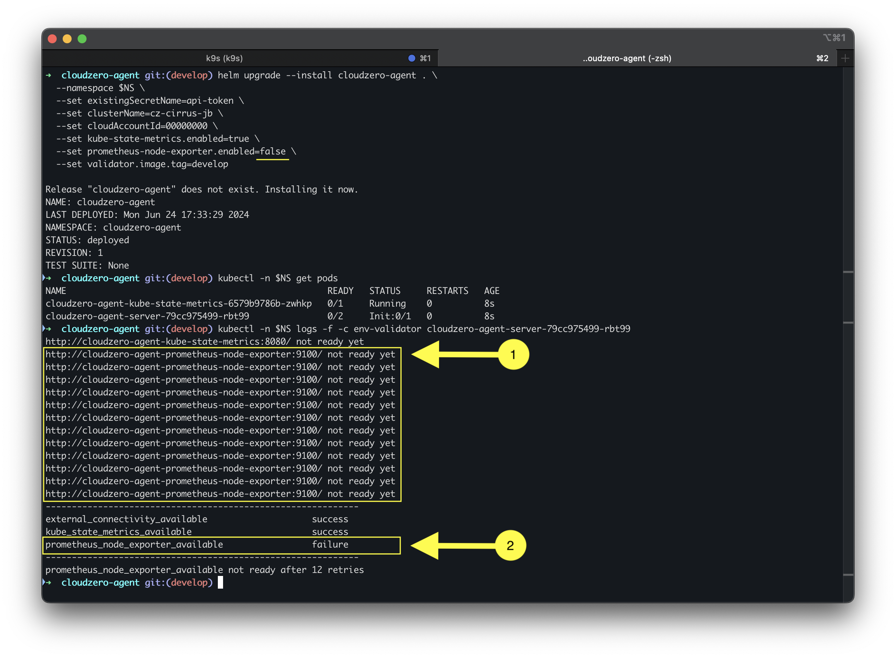

# How to Validate Deployment

This guide provides instructions on how to validate the deployment of the Helm chart and identify common problems. As part of the deployment, an environment validation container is started to execute environmental checks. This guide outlines how to use these to gather insight into issues post deployment.

## Step by Step



### 1. Get the pod names for the deployment
To retrieve the pod names for the deployment, use the following command:

```sh
kubectl -n cloudzero-agent get pods
```
> Note: Replace `cloudzero-agent` with the correct namespace for your deployment.

### 2. Identify the correct pod name
To inspect the logs of the `env-validator` container, you need to identify the pod name for the `cloudzero-agent-server` pod.

### 3. Read the logs for the `env-validator` container
Using the pod name obtained in step 2, run the following command:

```sh
kubectl -n cloudzero-agent logs -f -c env-validator <pod_name>
```
> Note: The `-f` flag is used to follow the logs, and the `-c env-validator` flag is used to read the logs of the specific container.

### 4. Interpret the Results

In the diagram above, you will see a table output with the results of each environmental check. If all checks show `success`, the deployment is successful and data should be flowing to cloudzero.

---

# Troubleshooting

The Cloudlock Agent must be able to contact both the `kubernetes metrics server` and the `prometheus node exporter`. The following diagram illustrates what you might see if communication is not possible between the `cloudzero-agent` and one of these services.



When inspecting the logs, pay attention to the readiness state of the target (in this case, the node-exporter). Additionally, note the resulting `failure` status for the check.

In this case, it is important to identify why the `cloudzero-agent` is unable to communicate with the failing container check.

1. Is the missing service deployed? Use `kubectl get pods` to check if the service is deployed. If not, deploy the necessary chart. The `cloudzero-agent` helm chart can deploy the `kubernetes metrics server` and the `prometheus node exporter` by setting the `enable` flags to `true` as shown in the first image above.

2. Is the `cloudzero-agent` deployed to the same network namespace? Linux cgroup namespaces isolate process(es) network, memory, and CPU. If the containers (pods) are in different namespaces, there is no direct way to communicate between them. Make sure to use the correct `--namespace` flag when deploying the chart.

If all else fails, reach out to support@cloudzero.com and provide the output, along with the output of `kubectl -n <namespace> describe all` for the deployment.

