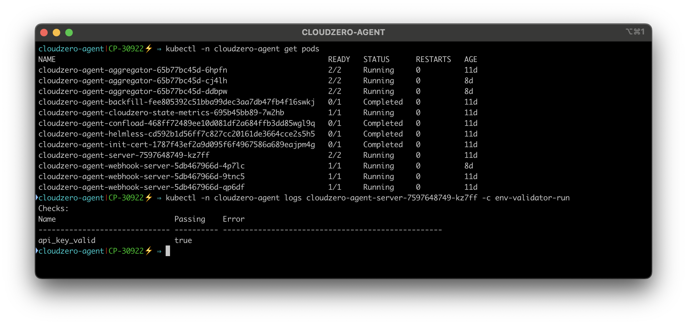

# Validating the Deployment

This guide provides instructions on how to validate the deployment of the Helm chart and identify common problems. It outlines how to use the environment validation container to gather insight into issues post deployment.

## Step by Step



### 1. Get the pod status for the deployment

To retrieve the pod status for the deployment, use the following command:

```sh
kubectl -n cloudzero-agent get pods
```

> Note: Replace `cloudzero-agent` with the correct namespace for your deployment.

### 2. Identify the agent server component

The agent server runs the main validation diagnostics. You can target it directly using labels instead of specific pod names.

### 3. Read the logs for the validator containers

The validator runs in multiple phases. To see the validation results:

**For pre-start validation (most common):**

```sh
kubectl -n cloudzero-agent logs -l app.kubernetes.io/component=server,app.kubernetes.io/name=cloudzero-agent -c env-validator-run
```

**For lifecycle validation logs:**

```sh
# Get the agent server pod name, then exec into it
AGENT_POD=$(kubectl -n cloudzero-agent get pods -l app.kubernetes.io/component=server,app.kubernetes.io/name=cloudzero-agent -o jsonpath='{.items[0].metadata.name}')
kubectl -n cloudzero-agent exec -ti $AGENT_POD -c cloudzero-agent-server -- cat cloudzero-agent-validator.log
```

**To check for validation errors quickly:**

```sh
AGENT_POD=$(kubectl -n cloudzero-agent get pods -l app.kubernetes.io/component=server,app.kubernetes.io/name=cloudzero-agent -o jsonpath='{.items[0].metadata.name}')
kubectl -n cloudzero-agent exec -ti $AGENT_POD -c cloudzero-agent-server -- cat cloudzero-agent-validator.log | jq -r 'select(.checks) | .checks[] | select(.error) | "\(.name): \(.error)"'
```

**To capture full diagnostics for support:**

```sh
AGENT_POD=$(kubectl -n cloudzero-agent get pods -l app.kubernetes.io/component=server,app.kubernetes.io/name=cloudzero-agent -o jsonpath='{.items[0].metadata.name}')
kubectl -n cloudzero-agent exec -ti $AGENT_POD -c cloudzero-agent-server -- cat cloudzero-agent-validator.log > cloudzero-diagnostics.log
```

> Note: The `env-validator-run` container performs the pre-start diagnostics during pod initialization. These commands use label selectors to automatically target the correct agent server pod. The lifecycle validation logs contain structured JSON output with detailed diagnostic information.

Diagnostics are run at 3 lifecycle phases of the `cloudzero-agent` pod deployment:

1. `Pod initialization` - basic configuration elements are validated, such as the API key and egress reachability.
2. `Post pod start` - the prometheus container runs the `post-start` checks, then posts a `cluster up` status to the Cloudzero API. Checks include validating the API key, capturing the Kubernetes version, inspecting the scrape configuration, and checking the kube-state-metrics service. The results are logged to the `/prometheus/cloudzero-validator.log` file in the container.
3. `Pre pod stop` - the prometheus container runs the `pre-stop` checks (usually none), then posts a `cluster down` status to the Cloudzero API.

### 4. Alternative: Direct pod access

If needed, you can also access the logs from the prometheus container directly:

```sh
AGENT_POD=$(kubectl -n cloudzero-agent get pods -l app.kubernetes.io/component=server,app.kubernetes.io/name=cloudzero-agent -o jsonpath='{.items[0].metadata.name}')
kubectl -n cloudzero-agent exec -ti $AGENT_POD -c cloudzero-agent-server -- cat cloudzero-agent-validator.log
```

### 5. Interpret the Results

In the screenshot above, notice the `checks` section. This section allows you to view the results of the configured checks. For any checks that are not passing, an error message will be captured to help diagnose the problem.

---

## Troubleshooting

The CloudZero Agent has the following requirements:

1. It must be able to communicate with the `Kubernetes metrics server`.
2. It must be provided with a valid Cloudzero API Token.
3. It must be able to communicate with the Cloudzero API to send metrics.
4. It must be configured to collect the correct metrics and labels to the Cloudzero API.

Based on these 5 requirements, the checks have been designed to help identify problems quickly during a new deployment. Using the tool, and log output, it should be possible to confirm this information.

**When contacting support**, please provide:

1. The diagnostic JSON file: `cloudzero-diagnostics.log` (created using the command in step 3)
2. Pod descriptions: `kubectl -n <namespace> describe all`
3. Any error output from the error checking command
4. Helmless job output (configuration and setup information):
   ```sh
   kubectl -n cloudzero-agent logs -l app.kubernetes.io/component=helmless --tail=10000
   ```

Contact support@cloudzero.com with this information for assistance.
