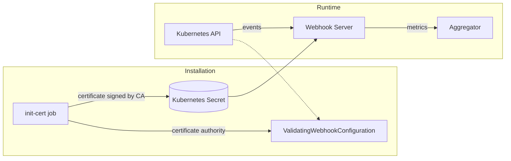
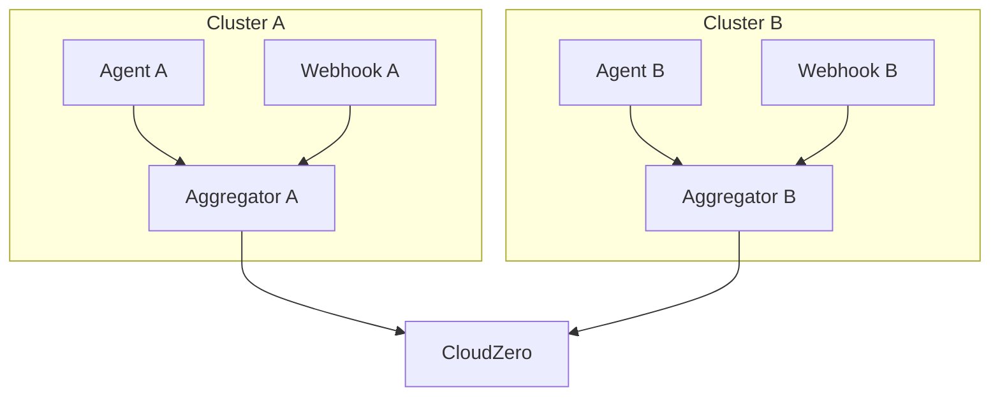
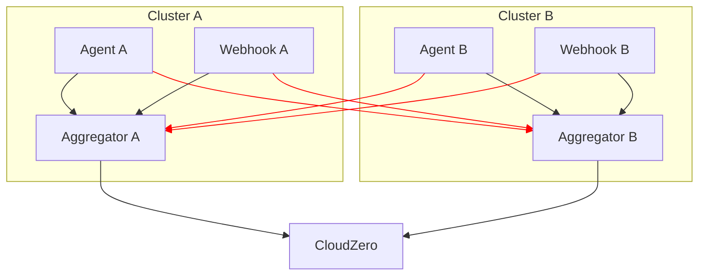

# Istio Integration

The CloudZero Agent attempts to detect Istio service mesh deployments and, when possible, configure itself accordingly. This document covers two Istio features that create challenges for the agent and how we address them.

## Strict mTLS

### What is Strict mTLS?

Istio can enforce mutual TLS (mTLS) on all traffic within the mesh. When a `PeerAuthentication` policy is set to **Strict** mode, pods reject any plain-text connections - all traffic must be encrypted using Istio-issued certificates.

Traffic enters the mesh through **sidecar injection** (in Sidecar mode) or **ambient enrollment** (in [Ambient mode](https://istio.io/latest/docs/ambient/overview/)):

- **Sidecar mode** injects an Envoy proxy container into each pod. All traffic passes through this sidecar, which handles mTLS termination and origination.

- **Ambient mode** (Istio 1.18+) uses a node-level proxy called ztunnel instead of per-pod sidecars. Traffic is transparently redirected through ztunnel without modifying pod definitions.

### How the Webhook Server Works

The CloudZero webhook server receives notifications from the Kubernetes API server when pods are created or updated. It extracts metadata (labels, annotations, ownership) for cost attribution purposes and sends this data to the aggregator.

By default, the webhook uses a self-signed TLS certificate. During installation, a Helm job (`init-cert`) generates this certificate and establishes trust:



The init-cert job creates a Certificate Authority, generates a server certificate signed by that CA, stores the certificate in a Kubernetes Secret for the webhook server to use, and writes the CA bundle to the `ValidatingWebhookConfiguration` so the Kubernetes API server trusts the webhook's certificate.

### How Strict mTLS Conflicts with the Webhook

When strict mTLS is enabled, the Envoy sidecar intercepts all traffic entering the pod - including webhook admission requests. When the API server connects to the webhook:

1. The API server initiates a TLS connection expecting the webhook's self-signed certificate
2. Envoy intercepts and attempts to terminate the connection with its own mTLS
3. Envoy presents an Istio-issued certificate instead of the webhook's certificate
4. The certificate chain doesn't match what the API server expects
5. The connection fails

The result: webhook admission requests fail, and the CloudZero Agent can't collect pod metadata.

### Solutions

#### cert-manager Integration (Preferred)

When cert-manager is enabled (`insightsController.tls.useCertManager: true`), we assume [istio-csr](https://cert-manager.io/docs/usage/istio-csr/) is installed. This integrates cert-manager with Istio's PKI, so the webhook receives certificates that Istio's mTLS accepts. There's no conflict because both systems use the same certificate authority.

#### Port Exclusion Annotations

When cert-manager is not in use, the chart tells Envoy to pass webhook traffic through without interception. Istio supports this through pod annotations:

```yaml
traffic.sidecar.istio.io/excludeInboundPorts: "8443"
```

When Istio is detected and cert-manager is not in use, the chart automatically adds this annotation to webhook pods. Traffic on port 8443 bypasses Envoy entirely, and the webhook's self-signed certificate works as expected.

The backfill job (which periodically scans the cluster for existing resources) also receives a port exclusion annotation:

```yaml
traffic.sidecar.istio.io/excludeOutboundPorts: "443"
```

This ensures the backfill job can communicate with the webhook server without Istio intercepting and wrapping the connection in mTLS.

## Cross-Cluster Load Balancing

### What is Cross-Cluster Load Balancing?

In multi-cluster Istio meshes, Istiod shares service endpoint information across all connected clusters. When a pod calls a service like `aggregator.cza.svc.cluster.local`, Istio may route that request to any cluster in the mesh that has matching endpoints. This enables cross-cluster load balancing and failover - if the local service is overloaded or unavailable, traffic automatically routes to another cluster.

### Why This Is Problematic for CloudZero

Each CloudZero aggregator collects and attributes metrics for its own cluster. The architecture looks like this:



With cross-cluster load balancing, Istio may route traffic to the wrong aggregator:



If Istio routes traffic from Cluster A's agent to Cluster B's aggregator, those metrics get attributed to the wrong cluster. The cost data becomes corrupted - you'd see Cluster A's workloads appearing in Cluster B's reports.

### Preventing Cross-Cluster Requests

The chart creates Istio routing rules that keep aggregator traffic local. A `DestinationRule` defines which pods are "local" using the `topology.istio.io/cluster` label (which Istio adds to pods during injection), and a `VirtualService` routes all traffic to that subset:

```yaml
apiVersion: networking.istio.io/v1
kind: DestinationRule
spec:
  host: aggregator.cza.svc.cluster.local
  subsets:
    - name: local-cluster
      labels:
        topology.istio.io/cluster: <cluster-id>
---
apiVersion: networking.istio.io/v1
kind: VirtualService
spec:
  http:
    - route:
        - destination:
            subset: local-cluster
          weight: 100
```

This requires knowing the Istio cluster ID. The chart computes an "effective cluster ID" using:

```text
effective = integrations.istio.clusterID || clusterName
```

If you explicitly set `integrations.istio.clusterID`, that value is used. Otherwise, the chart falls back to `clusterName`.

In sidecar mode, the validator queries the local Envoy sidecar at `localhost:15000` to verify this value matches what Istio actually reports.

### The Ambient Mode Wrinkle

Ambient mode introduces a complication: there's no sidecar to query.

In sidecar mode, each pod has an Envoy proxy at `localhost:15000` that we can query to verify the cluster ID configuration. If you set `integrations.istio.clusterID` to the wrong value, the validator detects the mismatch and reports an error.

In ambient mode, traffic is handled by the node-level ztunnel proxy - there's nothing inside the pod to query. We detect ambient mode by checking for the `ambient.istio.io/redirection: enabled` annotation that Istio's CNI sets on enrolled pods.

**The problem**: In ambient mode, we cannot verify that you've configured the cluster ID correctly. If you set it to an incorrect value:

- The `DestinationRule` will select pods with the wrong `topology.istio.io/cluster` label
- No pods will match, so traffic has no valid destination
- The collector and webhook server will be unable to send data to the aggregator
- Metric collection stops

For this reason, **ambient mode requires explicit configuration** of `integrations.istio.clusterID`. The chart won't fall back to `clusterName` since a misconfiguration cannot be detected and would cause silent data loss.

## Configuration

### Quick Reference

| Deployment Type                                         | Configuration Needed                          |
| ------------------------------------------------------- | --------------------------------------------- |
| Single cluster, no Istio                                | None                                          |
| Single cluster with Istio                               | None (port exclusions auto-detected)          |
| Multi-cluster sidecar mode, `clusterName` matches Istio | None                                          |
| Multi-cluster sidecar mode, `clusterName` differs       | Set `integrations.istio.clusterID`            |
| Multi-cluster ambient mode                              | Set `integrations.istio.clusterID` (required) |

### Settings

```yaml
integrations:
  istio:
    enabled: null # null=auto-detect, true=force enable, false=disable
    clusterID: null # Istio cluster ID for traffic fencing
```

| Setting                        | Type      | Default | Description                                                                  |
| ------------------------------ | --------- | ------- | ---------------------------------------------------------------------------- |
| `integrations.istio.enabled`   | null/bool | `null`  | `null` auto-detects via CRD presence, `true` forces enable, `false` disables |
| `integrations.istio.clusterID` | string    | `null`  | Istio cluster ID for traffic fencing; required in ambient mode               |

### Finding Your Istio Cluster ID

```bash
# Query the istiod deployment
kubectl -n istio-system get deploy istiod \
  -o jsonpath='{.spec.template.spec.containers[0].env[?(@.name=="CLUSTER_ID")].value}'

# Or query any Istio-injected pod's bootstrap config
istioctl proxy-config bootstrap <pod>.<namespace> -o yaml | \
  grep 'CLUSTER_ID:' | awk '{print $2}'
```
