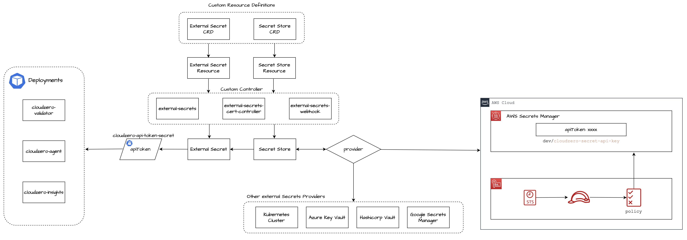

# **Setting Up External Secrets Operator with AWS Secrets Manager on EKS**



This guide will walk you through setting up the External Secrets Operator to sync secrets from AWS Secrets Manager to your Kubernetes cluster running on Amazon EKS.

---

## **Prerequisites**

Before you begin, ensure you have the following tools installed and configured:

- **AWS CLI**: Installed and configured with credentials that have the necessary permissions.
  - **Installation**: [AWS CLI Installation Guide](https://docs.aws.amazon.com/cli/latest/userguide/install-cliv2.html)
  - **Configuration**: Run `aws configure` to set up your credentials.
- **EKSCTL**: Installed for creating and managing EKS clusters.
  - **Installation**: [EKSCTL Installation Guide](https://eksctl.io/introduction/#installation)
- **kubectl**: Installed and configured to interact with your EKS cluster.
  - **Installation**: [kubectl Installation Guide](https://kubernetes.io/docs/tasks/tools/)
- **Helm**: Installed for deploying the External Secrets Operator.
  - **Installation**: [Helm Installation Guide](https://helm.sh/docs/intro/install/)

---

## **Step 1: Create an Amazon EKS Cluster**

We'll use `eksctl` to create a new EKS cluster.

1. **Create a Cluster Configuration File**

   Create a file named `cluster.yaml` with the following content:

   ```yaml
   apiVersion: eksctl.io/v1alpha5
   kind: ClusterConfig

   metadata:
     name: toybox-eks-cluster
     region: us-east-1

   nodeGroups:
     - name: toybox-nodegroup-1
       instanceType: t3.small
       desiredCapacity: 1
       volumeSize: 8
   ```

   - **Note**: Replace `toybox-eks-cluster` with your desired cluster name and `us-east-1` with your preferred AWS region.

2. **Create the EKS Cluster**

   Run the following command to create the cluster:

   ```bash
   eksctl create cluster -f cluster.yaml
   ```

   - **Note**: This process may take several minutes to complete. Once finished, `kubectl` will be configured to interact with your new cluster.

---

## **Step 2: Install External Secrets Operator**

We'll use Helm to install the External Secrets Operator into your cluster.

1. **Add the External Secrets Helm Repository**

   ```bash
   helm repo add external-secrets https://charts.external-secrets.io
   helm repo update
   ```

2. **Create a Namespace for the Operator**

   It's recommended to install the operator in a dedicated namespace:

   ```bash
   kubectl create namespace external-secrets
   ```

3. **Install the Operator Using Helm**

   ```bash
   helm install external-secrets external-secrets/external-secrets \
     --namespace external-secrets
   ```

   - **Note**: This command installs the External Secrets Operator into the `external-secrets` namespace.

---

## **Step 3: Create a Secret in AWS Secrets Manager**

We'll create a secret in AWS Secrets Manager that we want to sync to Kubernetes.

1. **Create the Secret**

   ```bash
   aws secretsmanager create-secret \
     --region us-east-1 \
     --name 'dev/cloudzero-secret-api-key' \
     --secret-string "{\"apiToken\":\"$CZ_API_TOKEN\"}"
   ```

   - **Note**:
     - Replace `$CZ_API_TOKEN` with your actual API token or ensure that the `CZ_API_TOKEN` environment variable is set.
     - The secret is named `dev/cloudzero-secret-api-key`, which includes a path (`dev/`) for organizational purposes.

2. **Understand Secret Naming**

   - Using paths like `dev/` helps in organizing secrets and controlling access via IAM policies.
   - The ARN of this secret will be used when defining IAM policies in the next steps.

---

## **Step 4: Configure IAM Roles for Service Accounts (IRSA)**

To allow the operator to securely access AWS Secrets Manager, we'll use IAM Roles for Service Accounts.

### **Step 4.1: Enable the OIDC Provider for Your EKS Cluster**

1. **Associate the OIDC Provider**

   If you haven't enabled the OIDC provider for your cluster, run:

   ```bash
   eksctl utils associate-iam-oidc-provider --cluster toybox-eks-cluster --approve
   ```

   - **Note**: Replace `toybox-eks-cluster` with the name of your EKS cluster.

### **Step 4.2: Create an IAM Policy**

1. **Create the IAM Policy Document**

   Create a file named `external-secrets-policy.json` with the following content:

   ```json
   {
     "Version": "2012-10-17",
     "Statement": [
       {
         "Effect": "Allow",
         "Action": [
           "secretsmanager:GetSecretValue",
           "secretsmanager:DescribeSecret",
           "secretsmanager:ListSecrets"
         ],
         "Resource": "arn:aws:secretsmanager:us-east-1:<AWS_ACCOUNT_ID>:secret:dev/*"
       }
     ]
   }
   ```

   - **Note**:
     - Replace `<AWS_ACCOUNT_ID>` with your AWS account ID.
     - This policy allows access to all secrets under the `dev/` path.

2. **Create the IAM Policy**

   Run:

   ```bash
   aws iam create-policy \
     --policy-name ExternalSecretsPolicy \
     --policy-document file://external-secrets-policy.json
   ```

   - **Note**: Save the **Policy ARN** outputted by this command; you'll need it in the next step.

### **Step 4.3: Create an IAM Role and Kubernetes Service Account**

We'll create a Kubernetes Service Account associated with an IAM Role that has the necessary permissions.

1. **Create the IAM Service Account Using `eksctl`**

   ```bash
   eksctl create iamserviceaccount \
     --name external-secrets-irsa \
     --namespace default \
     --cluster toybox-eks-cluster \
     --role-name external-secrets-irsa-role \
     --attach-policy-arn arn:aws:iam::<AWS_ACCOUNT_ID>:policy/ExternalSecretsPolicy \
     --approve \
     --override-existing-serviceaccounts
   ```

   - **Notes**:
     - Replace `<AWS_ACCOUNT_ID>` with your AWS account ID.
     - Ensure `toybox-eks-cluster` matches your cluster name.
     - The `--attach-policy-arn` should point to the ARN of the policy you just created.

2. **Verify the Service Account Creation**

   ```bash
   kubectl get serviceaccount external-secrets-irsa -n default -o yaml
   ```

   - **Ensure** the service account has the annotation `eks.amazonaws.com/role-arn` pointing to the IAM role.

---

## **Step 5: Configure the SecretStore**

We need to configure a `SecretStore` resource that tells the External Secrets Operator how to access AWS Secrets Manager.

1. **Create the SecretStore Resource**

   Create a file named `secretstore.yaml` with the following content:

   ```yaml
   apiVersion: external-secrets.io/v1beta1
   kind: SecretStore
   metadata:
     name: cloudzero-secret-store
     namespace: default
   spec:
     provider:
       aws:
         service: SecretsManager
         region: us-east-1
         auth:
           jwt:
             serviceAccountRef:
               name: external-secrets-irsa
   ```

   - **Note**: Replace `us-east-1` with your AWS region if different.

2. **Apply the Configuration**

   ```bash
   kubectl apply -f secretstore.yaml
   ```

---

## **Step 6: Create an ExternalSecret Resource**

Define an `ExternalSecret` that specifies which secret to sync from AWS Secrets Manager to Kubernetes.

1. **Create the ExternalSecret Resource**

   Create a file named `externalsecret.yaml` with the following content:

   ```yaml
   apiVersion: external-secrets.io/v1beta1
   kind: ExternalSecret
   metadata:
     name: cloudzero-secret-api-key
     namespace: default
   spec:
     refreshInterval: 10m
     secretStoreRef:
       name: cloudzero-secret-store
       kind: SecretStore
     target:
       name: cloudzero-secret-api-key
     data:
       - secretKey: apiToken
         remoteRef:
           key: dev/cloudzero-secret-api-key
           property: apiToken
   ```

   - **Notes**:
     - This configuration will create a Kubernetes secret named `cloudzero-secret-api-key` in the `default` namespace.
     - It fetches the `apiToken` property from the AWS Secrets Manager secret `dev/cloudzero-secret-api-key`.

2. **Apply the Configuration**

   ```bash
   kubectl apply -f externalsecret.yaml
   ```

---

## **Step 7: Verify the Setup**

Ensure that the secret has been successfully synced.

1. **Check the Status of the ExternalSecret**

   ```bash
   kubectl get externalsecret cloudzero-secret-api-key -n default
   ```

   - **Expected Output**: The `STATUS` should indicate `SecretSynced` and `READY` should be `True`.
   - **If Not**: Inspect the IAM Policy and IAM Role Trust Policy, and ensure the external secret's `key` path to the AWS Secret is correct.

2. **Verify the Kubernetes Secret**

   ```bash
   kubectl get secret cloudzero-secret-api-key -n default -o yaml
   ```

   - **Note**: The secret data will be base64 encoded.

3. **Decode the Secret Value**

   To decode and view the `apiToken` value:

   ```bash
   kubectl get secret cloudzero-secret-api-key -n default -o jsonpath="{.data.apiToken}" | base64 --decode
   ```

---

## **Step 8: Use the Secret in the CloudZero Agent Deployment**

We'll now use the synced secret in deploying the CloudZero agent.

1. **Create an Override File**

   Create a file named `override.yaml` with the following content:

   ```yaml
   cloudAccountId: "1234567890"
   clusterName: eks-external-secrets
   region: us-east-1

   existingSecretName: cloudzero-secret-api-key

   serverConfig:
     containerSecretFileName: apiToken
   ```

   - **Notes**:
     - Replace `"1234567890"` with your actual CloudZero account ID.
     - `existingSecretName` should match the Kubernetes secret we created earlier.
     - `server.containerSecretFileName` should match the `secretKey` defined in the `ExternalSecret`.

2. **Install the CloudZero Agent Using Helm**

   ```bash
   helm install cloudzero-agent cloudzero/cloudzero-agent -f override.yaml
   ```

   - **Note**: Ensure you have the CloudZero Helm repository added to your Helm client.

3. **Verify the Deployment**

   - **Check the Pods**

     ```bash
     kubectl get pods
     ```

   - **View the Logs**

     ```bash
     kubectl logs deployment/cloudzero-agent-server -c env-validator
     ```

     - **Expected Output**:

       ```json
       {
         "account": "1234567890",
         "region": "us-east-1",
         "name": "eks-external-secrets",
         "state": "STATUS_TYPE_INIT_OK",
         "chartVersion": "0.0.0-dev",
         "validatorVersion": "cloudzero-agent-validator.x.y.z",
         "checks": [
           {"name": "egress_reachable", "passing": true},
           {"name": "api_key_valid", "passing": true}
         ]
       }
       ```

       - **Note**: The `validatorVersion` and `chartVersion` values will vary based on the versions you're using.

---

## **Troubleshooting**

If you encounter issues, here are steps to help diagnose and resolve them.

### **Verifying the IAM Policy**

- **Ensure** the IAM policy includes the necessary actions:
  - `secretsmanager:GetSecretValue`
  - `secretsmanager:DescribeSecret`
  - `secretsmanager:ListSecrets`
- **Verify** the `Resource` field correctly specifies the secrets you intend to access.

### **Verifying the IAM Role Trust Policy**

1. **Retrieve the Trust Policy**

   ```bash
   aws iam get-role --role-name external-secrets-irsa-role --query 'Role.AssumeRolePolicyDocument' --output json
   ```

2. **Verify the Trust Policy**

   - **Ensure** the OIDC provider ARN matches your cluster's OIDC provider.
   - **Confirm** the `Condition` includes the correct `StringEquals` for your service account's namespace and name.

### **Verifying the Service Account**

- **Check** that the service account `external-secrets-irsa` exists in the `default` namespace:

  ```bash
  kubectl get serviceaccount external-secrets-irsa -n default
  ```

- **Verify** the IAM role annotation:

  ```bash
  kubectl describe serviceaccount external-secrets-irsa -n default
  ```

  - Look for the `eks.amazonaws.com/role-arn` annotation.

### **Verifying Kubernetes Secrets**

- **Check if the Secret Exists**

  ```bash
  kubectl get secret cloudzero-secret-api-key -n default
  ```

- **If the Secret is Missing**, check the ExternalSecret status:

  ```bash
  kubectl describe externalsecret cloudzero-secret-api-key -n default
  ```

  - **Look** for any error messages in the `Events` section.

### **Inspecting Operator Logs**

- **Get the Operator Pod Name**

  ```bash
  kubectl get pods -n external-secrets
  ```

- **View the Logs**

  ```bash
  kubectl logs <operator-pod-name> -n external-secrets
  ```

  - **Note**: Replace `<operator-pod-name>` with the actual pod name.

- **Look for Errors**: Any authentication issues or permission denials will be logged here.

---

## **Additional Resources**

- **External Secrets Operator Documentation**: [external-secrets.io](https://external-secrets.io/)
- **AWS EKS Documentation**: [Amazon EKS User Guide](https://docs.aws.amazon.com/eks/)
- **IAM Roles for Service Accounts**: [IAM Roles for Service Accounts Documentation](https://docs.aws.amazon.com/eks/latest/userguide/iam-roles-for-service-accounts.html)
- **Helm Charts for External Secrets**: [Helm Chart Repository](https://github.com/external-secrets/external-secrets/tree/main/charts/external-secrets)

