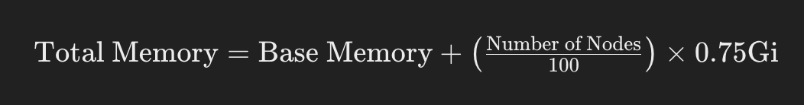

### Prometheus Agent Deployment Sizing Guide

#### Introduction

This guide outlines the recommended settings for deploying the Prometheus agent using the CloudZero Helm chart. It includes instructions on how to configure memory and CPU resources based on the size of your cluster.

#### Baseline Memory Requirements

- **Base Memory:** 512Mi
- **Base Memory Limit:** 1024Mi
- **Additional Memory:** 0.75Gi per 100 nodes in the cluster

#### Sizing Calculation

It is recommended to consider the shape and size of your prometheus cluster when setting resource memory limits for the prometheus agent. To calculate the memory requirements for your cluster, one can use the following formula:



> This guide uses a simple formula based on number of nodes, however your milage may vary if you have:
> 
> * Very large machines, with a large number of pods
> 
> * High churn pods or jobs. Each pod started will trigger allocation of a time seriese based metrics cache in the agent. If it restarts, a new cache is created. The cache will resize in memory for the look back period to handle remote write failures (2 hours).
> 


#### Sample values.yaml Configuration

Modify or create a `values.yaml` file with the following content to configure the resource limits and requests for your Prometheus agent deployment. Replace `<NUMBER_OF_NODES>` with the actual number of nodes in your cluster:

```yaml
server:
  name: server
  ...
  resources:
    requests:
      memory: 512Mi
      cpu: 250m
    limits:
      memory: "<CALCULATED_MEMORY_LIMIT>"
  ...
```

When using Helm, you can provide specific values in a separate `values-override.yml` file to override the defaults specified in the original `values.yml`. This approach allows you to override only the necessary values rather than providing the entire block.


#### Example Configuration for 200 Nodes

Calculate the memory limit based on the number of nodes, for example 200 nodes, the configuration would be:

 


Example `values-override.yml`:
```yaml
server:
  resources:
    requests:
      memory: 512Mi
      cpu: 250m
    limits:
      memory: 2048Mi
```

This file only includes the overrides for the server resources size limit.

#### Installation Instructions

1. **Add the Helm Repository**

    ```sh
    helm repo add cloudzero https://cloudzero.github.io/cloudzero-charts
    helm repo update
    ```

2. **Install Helm Chart**

    The chart can be installed directly with Helm or any other common Kubernetes deployment tools.

    **Install with Helm:**

    ```sh
    helm install <RELEASE_NAME> cloudzero/cloudzero-agent \
        --set existingSecretName=<NAME_OF_SECRET> \
        --set clusterName=<CLUSTER_NAME> \
        --set cloudAccountId=<CLOUD_ACCOUNT_ID> \
        --set region=<REGION> \
        -f values.yml \
        -f values-override.yml
    ```

    **Upgrade an Existing Installation:**

    ```sh
    helm upgrade <RELEASE_NAME> cloudzero/cloudzero-agent \
        --set existingSecretName=<NAME_OF_SECRET> \
        --set clusterName=<CLUSTER_NAME> \
        --set cloudAccountId=<CLOUD_ACCOUNT_ID> \
        --set region=<REGION> \
        -f values.yml \
        -f values-override.yml
    ```

By following these instructions, you can ensure your Prometheus agent is properly sized to handle your cluster's load, preventing potential memory issues and ensuring smooth operation.