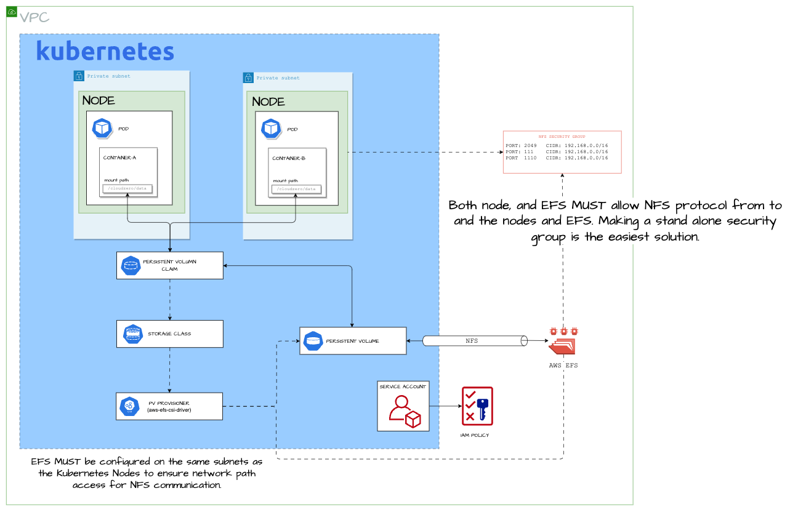

# Guide: Setting Up Amazon EFS with AWS EKS Using the AWS EFS CSI Driver

The **CloudZero Agent** is a stateful application that requires persistent storage to retain and process historical data. By default, the agent uses ephemeral `emptyDir` volumes, which do not persist data across pod restarts or redeployments. To ensure data continuity during upgrades, failures, or scaling events, it is **highly recommended** to configure persistent storage.

This guide explains how to configure AWS and Kubernetes resources to provide persistent storage for the CloudZero Agent in your EKS cluster.

## Why EFS?

Amazon Elastic File System (EFS) is the ideal storage solution for our use case because it supports concurrent read/write access across multiple pods on different nodes. In contrast, Amazon Elastic Block Store (EBS) permits only single-instance attachments in read-write mode, making it unsuitable for scenarios that require multi-writer/reader access.

EFS not only meets our shared access needs but also delivers high performance—offering up to 20 GiB/s of read throughput and 5 GiB/s of write throughput per file system.

Our architecture employs multiple horizontally scalable "Collector" applications to gather metrics via an exposed API, alongside a dedicated "Shipper" application that periodically pushes the collected data to a CloudZero-provided S3 bucket. This design demands a storage solution that can simultaneously handle multiple writers and a reader, making EFS the clear choice.

### Storage Capacity & Data Access Patterns

| **Metric**                     | **Value** | **Description**                                                  |
|--------------------------------|-----------|------------------------------------------------------------------|
| **Desired Storage Capacity**   | 1 TB      | Sufficient for 90 days of data from the expected cluster workload|
| **Frequent Access**            | 5%        | Data accessed multiple times during the initial write/read cycle |
| **Archive Storage**            | 95%       | Data typically accessed once a year before the cleanup cycle     |

### Throughput Requirements

| **Data Type** | **Monthly Volume** |
|---------------|--------------------|
| **Read**      | 333 GB             |
| **Write**     | 333 GB             |

### Estimated Monthly Costs

| **Cost Component**           | **Amount (USD)** |
|------------------------------|------------------|
| **Throughput Cost**          | ~$29.97         |
| **Storage & Access Charges** | ~$15.26         |
| **Total Monthly Cost**       | **~$45.23**     |

Using the [AWS Calculator](https://calculator.aws/#/createCalculator/EFS), these estimates confirm that EFS is both technically and economically well-suited to support the CloudZero Agent’s persistent storage requirements. 

Below is an improved version of the "System Overview" section that highlights how each component supports the CloudZero Agent and its requirements. This version uses a Markdown table for clarity.

---

Below is the updated version of your "System Overview" section with clarifications regarding namespace bindings:

---

## System Overview



The diagram above illustrates all the elements of the architecture. The table below details the purpose of each component and explains how it supports the CloudZero Agent.

| **Component**                          | **Description & Role in Supporting the CloudZero Agent**                                                                                                                                                                                                                                                                                                                                                                                                                                                                                                  |
|----------------------------------------|-------------------------------------------------------------------------------------------------------------------------------------------------------------------------------------------------------------------------------------------------------------------------------------------------------------------------------------------------------------------------------------------------------------------------------------------------------------------------------------------------|
| **POD**                                | The CloudZero Agent pod is a group of one or more application containers that share a common network namespace and storage. Pods serve as the basic deployable unit, ensuring that all containers within a pod can work together—such as one container writing data and another reading it. |
| **CONTAINER**                          | A container is a lightweight, standalone executable that runs the CloudZero Agent application and its dependencies. Each container mounts the shared `/data` volume provided by the PVC, enabling the agent to persist and share data between its internal processes (e.g., the Collector and Shipper). |
| **CONTAINER MOUNT POINT**              | The designated directory inside a container where an external volume is attached. For the CloudZero Agent, the `/data` mount point provides access to the shared storage that holds metrics and payload files, ensuring data persistence and facilitating inter-container communication.  |
| **PERSISTENT VOLUME CLAIM (PVC)**      | A user’s request for storage that abstracts the details of the underlying storage. The PVC binds to a pre-defined Persistent Volume (PV) that meets its requirements. For CloudZero, the PVC ensures that every pod gets consistent access to a shared storage resource, which is essential for both the Collector and Shipper functions. **Note:** The PVC must reside in the same namespace as the CloudZero Agent pod deployment. |
| **PERSISTENT VOLUME (PV)**             | A provisioned piece of storage in the cluster, created either statically or dynamically, that backs one or more PVCs. In our setup, it represents the allocated portion of Amazon EFS that the CloudZero Agent uses to store and retrieve data. **Note:** PVs are cluster-scoped resources and do not reside in any specific namespace. |
| **STORAGE CLASS**                      | A Kubernetes resource that defines storage parameters (such as reclaim policies and performance characteristics) and enables dynamic provisioning of PVs. The storage class specifies the use of the AWS EFS CSI driver, which is critical for allowing multiple pods to share the same persistent volume across nodes—a key requirement for the CloudZero Agent’s multi-writer/reader scenario. **Note:** The storage class is typically deployed in the `kube-system` namespace. |
| **PV PROVISIONER<br/>(aws-efs-csi-driver)** | The AWS EFS CSI Driver implements the Kubernetes Container Storage Interface (CSI) to manage the lifecycle of Amazon EFS file systems. It supports both dynamic and static provisioning by creating access points for each PV. CloudZero Agent uses dynamic provisioning to automatically create the necessary access points in EFS, ensuring that all pods can mount a consistent, shared `/data` volume for storing metrics and payload files. This component is typically deployed in the `kube-system` namespace. |
| **SERVICE ACCOUNT**                    | A Kubernetes identity that allows pods to interact securely with the Kubernetes API and AWS services. Service accounts are namespace-scoped. For system components such as the AWS EFS CSI driver, the service account is typically created in the `kube-system` namespace. For CloudZero Agent pods, the service account should reside in the same namespace as the deployment. |
| **IAM POLICY**                         | An AWS policy that defines the permissions required to interact with AWS services such as EFS. This policy is attached to the service account to authorize necessary operations for provisioning, mounting, and managing the EFS file system. This ensures that the CloudZero Agent can operate securely within the AWS environment. |
| **NFS**                                | The Network File System (NFS) protocol facilitates shared file access over a network. Amazon EFS uses NFS to enable multiple pods to read from and write to the shared storage simultaneously, which is essential for the CloudZero Agent’s need to handle data concurrently across its Collector and Shipper components. |
| **SUBNETS**                            | The network segments that connect the Kubernetes nodes. The EFS file system is deployed within the same subnets as the nodes to ensure proper routing and communication. This connectivity is crucial for the CloudZero Agent, as it relies on efficient network access to the shared storage provided by EFS via NFS. |
| **SECURITY GROUP**                     | A virtual firewall that controls inbound and outbound traffic. The security group associated with the EFS file system is configured to allow NFS traffic between Kubernetes nodes and the EFS instance, ensuring that the CloudZero Agent’s data operations (read and write) occur seamlessly and securely across the cluster. |

---
---

## Part 1: CSI DRIVER SETUP


### 1. Create the IAM Policy File

Create a file named `aws-efs-csi-driver-iam-policy.json` with the following contents:

```json
{
  "Version": "2012-10-17",
  "Statement": [
    {
      "Effect": "Allow",
      "Action": [
        "elasticfilesystem:DescribeAccessPoints",
        "elasticfilesystem:DescribeFileSystems",
        "elasticfilesystem:DescribeMountTargets",
        "ec2:DescribeAvailabilityZones"
      ],
      "Resource": "*"
    },
    {
      "Effect": "Allow",
      "Action": [
        "elasticfilesystem:CreateAccessPoint"
      ],
      "Resource": "*",
      "Condition": {
        "StringLike": {
          "aws:RequestTag/efs.csi.aws.com/cluster": "true"
        }
      }
    },
    {
      "Effect": "Allow",
      "Action": [
        "elasticfilesystem:TagResource"
      ],
      "Resource": "*",
      "Condition": {
        "StringLike": {
          "aws:ResourceTag/efs.csi.aws.com/cluster": "true"
        }
      }
    },
    {
      "Effect": "Allow",
      "Action": "elasticfilesystem:DeleteAccessPoint",
      "Resource": "*",
      "Condition": {
        "StringEquals": {
          "aws:ResourceTag/efs.csi.aws.com/cluster": "true"
        }
      }
    }
  ]
}
```

### 2. Create the IAM Policy

Run the following command to create the policy in AWS:

```sh
aws iam create-policy \
    --policy-name EKS_EFS_CSI_Driver_Policy \
    --policy-document file://aws-efs-csi-driver-iam-policy.json
```

### 3. Create the Service Account

Using `eksctl`, create a service account in the `kube-system` namespace that is associated with the policy:

```sh
eksctl create iamserviceaccount \
    --cluster cirrus-release-rc1 \
    --namespace kube-system \
    --name efs-csi-controller-sa \
    --attach-policy-arn arn:aws:iam::<YOUR_ACCOUNT_ID>:policy/EKS_EFS_CSI_Driver_Policy \
    --approve \
    --region us-east-2
```

> **Tip:** Replace `<YOUR_ACCOUNT_ID>` with your actual AWS account ID.

This guide uses `eksctl` for configuring the `service account` and IAM Policy linkage through OIDC. There are other methods provide in the [AWS documentation](https://docs.aws.amazon.com/eks/latest/userguide/enable-iam-roles-for-service-accounts.html). Select the method which appropriate for your Organization.

### 4. Add the Helm Repository

Add the AWS EFS CSI driver Helm repository:

```sh
helm repo add aws-efs-csi-driver https://kubernetes-sigs.github.io/aws-efs-csi-driver/
```

### 5. Update the Helm Repository

Update the Helm repository to ensure you have the latest charts:

```sh
helm repo update aws-efs-csi-driver
```

### 6. Install the AWS EFS CSI Driver

Install (or upgrade) the driver in the `kube-system` namespace. If you created the service account separately, pass the additional parameters so Helm uses your existing service account:

```sh
helm upgrade --install aws-efs-csi-driver --namespace kube-system aws-efs-csi-driver/aws-efs-csi-driver \
    --set controller.serviceAccount.create=false \
    --set controller.serviceAccount.name=efs-csi-controller-sa
```

---

Below is the updated section of the guide that includes enhanced security group rules for both ingress and egress on TCP and UDP for ports 111, 1110, and 2049.

---

## Part 2: CREATING THE NFS SECURITY GROUP

### 1. Get the VPC Identity for Your Cluster

Retrieve your cluster’s VPC ID using the following command. Replace `<your-cluster-name>` with your EKS cluster name:

```bash
aws eks describe-cluster --name <your-cluster-name> --query "cluster.resourcesVpcConfig.vpcId" --output text
```

This command returns your VPC ID (for example, `vpc-0abc123def456ghi`).

---

### 2. Get the VPC CIDR

With your VPC ID, obtain the CIDR block associated with that VPC:

```bash
aws ec2 describe-vpcs --vpc-ids <vpc-id> --query "Vpcs[0].CidrBlock" --output text
```

Replace `<vpc-id>` with the VPC ID from the previous step. This command returns the CIDR block (for example, `192.168.0.0/16`).

---

### 3. Create a Security Group with Enhanced NFS Rules

First, create a new security group dedicated to NFS access. Replace `<security-group-name>` with your desired name (e.g., `efs-nfs-sg`) and `<vpc-id>` with your VPC ID:

```bash
aws ec2 create-security-group --group-name <security-group-name> --description "Security group for NFS access to EFS" --vpc-id <vpc-id>
```

This command returns a JSON response that includes the new security group’s ID (for example, `"GroupId": "sg-0123abc456def7890"`). Note this ID for the following steps.

#### a. Add Ingress Rules

Authorize inbound traffic for the required ports (111, 1110, and 2049) for both TCP and UDP protocols. Replace `<security-group-id>` with your security group ID and `<vpc-cidr>` with your VPC CIDR (e.g., `192.168.0.0/16`).

For port 111:
```bash
aws ec2 authorize-security-group-ingress --group-id <security-group-id> --protocol tcp --port 111 --cidr <vpc-cidr>
aws ec2 authorize-security-group-ingress --group-id <security-group-id> --protocol udp --port 111 --cidr <vpc-cidr>
```

For port 1110:
```bash
aws ec2 authorize-security-group-ingress --group-id <security-group-id> --protocol tcp --port 1110 --cidr <vpc-cidr>
aws ec2 authorize-security-group-ingress --group-id <security-group-id> --protocol udp --port 1110 --cidr <vpc-cidr>
```

For port 2049:
```bash
aws ec2 authorize-security-group-ingress --group-id <security-group-id> --protocol tcp --port 2049 --cidr <vpc-cidr>
aws ec2 authorize-security-group-ingress --group-id <security-group-id> --protocol udp --port 2049 --cidr <vpc-cidr>
```

#### b. Add Egress Rules

Similarly, authorize outbound traffic for the same ports and protocols. Replace `<security-group-id>` and `<vpc-cidr>` accordingly.

For port 111:
```bash
aws ec2 authorize-security-group-egress --group-id <security-group-id> --protocol tcp --port 111 --cidr <vpc-cidr>
aws ec2 authorize-security-group-egress --group-id <security-group-id> --protocol udp --port 111 --cidr <vpc-cidr>
```

For port 1110:
```bash
aws ec2 authorize-security-group-egress --group-id <security-group-id> --protocol tcp --port 1110 --cidr <vpc-cidr>
aws ec2 authorize-security-group-egress --group-id <security-group-id> --protocol udp --port 1110 --cidr <vpc-cidr>
```

For port 2049:
```bash
aws ec2 authorize-security-group-egress --group-id <security-group-id> --protocol tcp --port 2049 --cidr <vpc-cidr>
aws ec2 authorize-security-group-egress --group-id <security-group-id> --protocol udp --port 2049 --cidr <vpc-cidr>
```

These commands configure the security group to allow both inbound and outbound (egress) NFS-related traffic over the specified ports and protocols, ensuring that your EKS nodes can communicate with your Amazon EFS file system.

---

### 4. Attach the Security Group to the Node Group Definition

To ensure that your EKS nodes can access the EFS file system via NFS, you must attach the new security group to your node group. If your node group uses a custom launch template, update the launch template to include the new security group ID.

#### a. Create a New Launch Template Version with the Additional Security Group

Assuming you have an existing launch template, create a new version that adds the NFS security group alongside the default ones. Replace `<launch-template-id>`, `<default-sg-id>`, and `<efs-nfs-sg-id>` with the appropriate values:

```bash
aws ec2 create-launch-template-version \
  --launch-template-id <launch-template-id> \
  --version-description "Add EFS NFS security group" \
  --launch-template-data '{"NetworkInterfaces": [{"DeviceIndex": 0, "Groups": ["<default-sg-id>", "<efs-nfs-sg-id>"]}]}'
```

This command creates a new launch template version that includes both the default security group and your new EFS NFS security group.

#### b. Update Your Node Group to Use the New Launch Template Version

Once the new launch template version is created, update your EKS managed node group to use it. Replace `<cluster-name>`, `<nodegroup-name>`, `<launch-template-name>`, and `<new-version-number>` accordingly:

```bash
aws eks update-nodegroup-config \
  --cluster-name <cluster-name> \
  --nodegroup-name <nodegroup-name> \
  --launch-template "name=<launch-template-name>,version=<new-version-number>"
```

This updates your node group configuration so that new nodes (or nodes undergoing replacement) will use the updated launch template, which now includes the enhanced security group.

> **Note:**  
> - If you are not using a launch template (for example, if your node group was created with default settings), you’ll need to update the node group via the AWS Management Console or your infrastructure-as-code tool to include the new security group.
> - For managed node groups, security group settings are defined at creation time. Using a launch template to update these settings is the recommended approach.

---

Below is the guide section for adding a new file system to Amazon EFS with elastic provisioning, ensuring that it’s created in the same VPC as your EKS cluster, and that mount targets are correctly associated with your node group subnets using the proper security group.

---

## Part 3: Adding a New File System to Amazon EFS with Elastic Provisioning

### 1. Gather the Node Group Subnets

To ensure that the EFS file system is accessible from all nodes in your EKS cluster, first gather the subnet IDs used by your node groups. Replace `<your-cluster-name>` with your EKS cluster’s name:

```bash
aws eks describe-cluster --name <your-cluster-name> --query "cluster.resourcesVpcConfig.subnetIds" --output text
```

This command returns a space-separated list of subnet IDs (e.g., `subnet-12345678 subnet-87654321 …`) that your cluster uses. These subnets belong to the same VPC as your cluster.

---

### 2. Create the EFS File System

Create a new EFS file system within the same VPC. Use the following command to create the file system. Adjust parameters such as performance mode and encryption as needed:

```bash
aws efs create-file-system \
  --creation-token cloudzero-efs-$(date +%s) \
  --performance-mode generalPurpose \
  --encrypted
```

The command returns a JSON response containing details about your file system. **Note the `FileSystemId`** (for example, `fs-0123456789abcdef0`) for use in the next step.

---

### 3. Create Mount Targets in Each Node Group Subnet

For the EFS file system to be reachable from your cluster nodes, create a mount target in each node group subnet. Each mount target must be associated with the correct security group (the one you created with NFS rules) and a subnet from Step 1.

For each subnet, run the following command. Replace `<efs-file-system-id>` with the FileSystemId from Step 2, `<subnet-id>` with one of the subnet IDs, and `<efs-nfs-sg-id>` with your NFS security group ID:

```bash
aws efs create-mount-target \
  --file-system-id <efs-file-system-id> \
  --subnet-id <subnet-id> \
  --security-groups <efs-nfs-sg-id>
```

Repeat this command for each subnet in your list. This ensures that every subnet used by your EKS node groups has a corresponding mount target for the file system.

---

Below is the cleaned-up version of the final section. This section uses dynamic provisioning via the AWS EFS CSI driver to automatically create Persistent Volumes (PVs) when a Persistent Volume Claim (PVC) is applied. Remember that the StorageClass is a cluster-scoped resource, so it does not reside in any namespace, whereas the PVC and CloudZero Agent Pod must be deployed in the same namespace (for example, `default` or a dedicated namespace for CloudZero).

---

## Part 4: Create the StorageClass, Persistent Volume, and Persistent Volume Claim

In this section, we will create the StorageClass that leverages dynamic provisioning via the AWS EFS CSI driver. When you create a PVC that references this StorageClass, Kubernetes will automatically create (and bind) a PV for your CloudZero Agent.

### 1. Get the EFS File System ID

Use the following AWS CLI command to retrieve your EFS File System ID. Replace `<your-file-system-name>` with the name you gave your EFS file system:

```bash
aws efs describe-file-systems --query "FileSystems[?Name=='<your-file-system-name>'].FileSystemId" --output text
```

Make a note of the returned FileSystemId (e.g., `fs-079a359a9886e7ac1`), as you will need it in the next step.

---

### 2. Create the StorageClass

Create a YAML file (for example, `specs/sc.yaml`) with the following content. Be sure to replace the `fileSystemId` value with your actual EFS File System ID:

```yaml
kind: StorageClass
apiVersion: storage.k8s.io/v1
metadata:
  name: cloudzero-efs-sc
provisioner: efs.csi.aws.com
parameters:
  provisioningMode: efs-ap
  fileSystemId: fs-079a359a9886e7ac1  # Replace with your actual EFS File System ID
  directoryPerms: "700"
  gidRangeStart: "1000"    # optional
  gidRangeEnd: "2000"      # optional
  basePath: "/dynamic_provisioning"
  subPathPattern: "${.PVC.namespace}/${.PVC.name}"  # optional
  ensureUniqueDirectory: "true"
  reuseAccessPoint: "false"
```

Apply the StorageClass:

```bash
kubectl apply -f specs/sc.yaml
```

> **Important:** The StorageClass is cluster-scoped and does not reside in any specific namespace.

---

### 3. Create the Persistent Volume Claim (PVC)

Create a YAML file (for example, `specs/efs-pvc.yaml`) that defines the PVC and binds it to the `cloudzero-efs-sc` StorageClass:

```yaml
apiVersion: v1
kind: PersistentVolumeClaim
metadata:
  name: cloudzero-efs-claim
  # Ensure this resource is created in the same namespace as your CloudZero Agent deployment
spec:
  accessModes:
    - ReadWriteMany  # Essential for horizontal scaling
  storageClassName: cloudzero-efs-sc
  resources:
    requests:
      storage: 1024Gi
```

Apply the PVC:

```bash
kubectl apply -f specs/efs-pvc.yaml
```

> **Important:** Create the PVC in the same namespace as the CloudZero Agent Pod. For example, if your agent is deployed in the `default` namespace, ensure this PVC is also created there.

---

### 4. Deploy the CloudZero Agent Using the PVC and Service Account

Finally, deploy the CloudZero Agent (or a sample agent for testing) so that it uses the PVC for persistent storage. Create a YAML file (for example, `specs/cloudzero-agent.yaml`) with the following content:

```yaml
apiVersion: v1
kind: Pod
metadata:
  name: cloudzero-fake-agent-app
  # Ensure this Pod is created in the same namespace as the PVC
spec:
  serviceAccountName: <your-service-account>  # Replace with the appropriate service account if needed
  containers:
    - name: app
      image: centos
      command: ["/bin/sh"]
      args: ["-c", "while true; do echo $(date -u) >> /data/out; sleep 5; done"]
      volumeMounts:
        - name: persistent-storage
          mountPath: /data
  volumes:
    - name: persistent-storage
      persistentVolumeClaim:
        claimName: cloudzero-efs-claim
```

Deploy the agent Pod:

```bash
kubectl apply -f specs/cloudzero-agent.yaml
```

> **CIRRUS TEAM NOTES:**  
> We will add Helm support in a future release to allow clients to easily use the PVC with configurable parameters.


---

# Troubleshooting

Issues can arise for a number of reasons, and unfortunately, online resources aren’t always clear. The following troubleshooting steps may help you identify and resolve common problems with your deployment.

## 1. `"Mount attempt 1/3 failed due to timeout after 15 sec, wait 0 sec before next"`

This error indicates that the client (either on a pod or a node) is unable to mount the EFS file system within the expected time frame. Common causes include:

### a. Routing Issues
- **VPC Mismatch:**  
  Ensure that the EFS file system is created in the same VPC as your EKS cluster.
- **Subnet Mismatch:**  
  Verify that the subnets used for the EFS mount targets match the subnets where your EKS nodes reside.
- **Network ACLs and Routing Tables:**  
  Check that your VPC’s routing tables and network ACLs are not blocking traffic between your nodes and the EFS mount targets.

### b. Security Group Misconfigurations
- **EFS Mount Target Rules:**  
  Confirm that the security group attached to your EFS mount targets allows inbound traffic on the required ports (TCP and UDP on ports 111, 1110, and 2049) from your node subnets.
- **Node Group Rules:**  
  Ensure that the security groups associated with your EKS nodes allow outbound traffic to the EFS file system on these ports.

### c. NFS and CSI Driver Issues
- **NFS Protocol:**  
  Verify that the NFS protocol is supported and enabled in your environment.
- **CSI Driver Logs:**  
  Check the logs of the AWS EFS CSI Driver (typically running in the `kube-system` namespace) for any error messages or additional context:
  
  ```bash
  kubectl logs -n kube-system -l app=efs-csi-driver
  ```

### d. General Debugging Steps
- **Pod Events and Logs:**  
  Use the following command to inspect events for the affected pod:
  
  ```bash
  kubectl describe pod <pod-name>
  ```
  
  Review these events for clues regarding mount failures.
- **Manual Mount Test:**  
  From an affected node, attempt to manually mount the EFS file system using an NFS client. This can help verify if the issue is due to network connectivity or security group settings.
- **AWS Console Verification:**  
  In the AWS Management Console, review the EFS dashboard to ensure that:
  - The file system shows healthy mount targets in each subnet.
  - There are no alerts or errors reported for the file system.

By systematically checking these areas, you can isolate and resolve the common causes of mounting timeouts and other EFS-related issues in your EKS cluster.